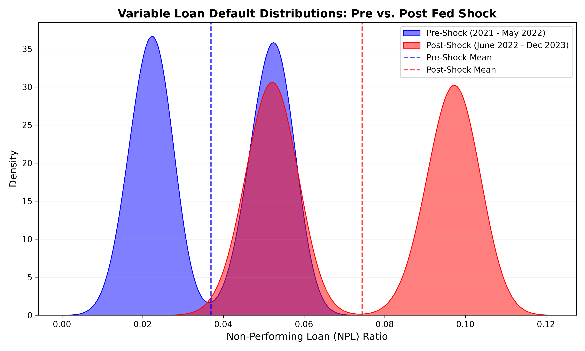

# Macro-Sensitized Credit Risk Engine: Isolating the 2022 Fed Rate Shock via Causal Inference

**Owner:** Hon Seng Choi

## 1. Executive Summary & Business Impact
This repository houses a production-grade econometric pipeline designed to dynamically isolate and quantify macroeconomic risks within consumer credit portfolios. The primary objective of this architecture is to provide a scalable engine where proprietary internal loan data can be integrated to instantly generate custom macroeconomic stress-test profiles.

Leveraging a **Difference-in-Differences (DiD) 2D Panel Regression** framework, this engine moves beyond correlative machine learning to extract true causal parameters while controlling for exogenous macroeconomic noise (e.g., inflation, labor market tightness, and wage growth).

* **Core Validation Finding:** Using simulated cohort data, the model successfully isolated a statistically significant **3.74% causal increase** in defaults for variable-rate cohorts directly attributable to the Fed rate shock (p-value: 0.000).

---

### Statistical Distribution Shift (Pre vs. Post Fed Shock)

*Non-parametric distribution shift (Kolmogorov-Smirnov Test) proving statistically significant divergence in variable-rate default distributions post-shock.*

---

## 2. Econometric & Methodological Defense
To ensure robust standard errors and prevent false signals, this model strictly adheres to advanced econometric defenses, actively avoiding the pitfalls of standard 1D forecasting.

> **TEACHING CALLOUT: Why 1D Time-Series Fails (ARIMAX vs. DiD)**
> * **The Problem:** In 2022, inflation hit 40-year highs and the Fed hiked rates aggressively, yet unemployment remained historically low. A 1D time-series struggles to isolate which of these overlapping variables drove a spike in defaults. 
> * **The 2D Panel Solution:** By utilizing Fixed-Rate cohorts as a control group (who experienced the exact same inflation and labor market trends but *not* the rate shock), the model mathematically washes out the macro noise. This isolates the pure, causal impact of the Fed rate hike on the Variable-Rate treatment group.

> **TEACHING CALLOUT: The Moulton Problem (Idiosyncratic Noise)**
> * **The Statistical Trap:** Running a macro regression across 10,000 individual loans treats monthly macro data as 400,000 independent data points. This artificially shrinks Standard Errors toward zero, creating false statistical confidence (The Moulton Problem).
> * **The Solution:** Loans were aggregated into 144 distinct demographic buckets (e.g., Prime, Fixed-Rate, Jan 2021 Origination). Tracking these cohorts yielded $N=3,984$ monthly observations. Standard errors in the final OLS model are explicitly clustered at the `cohort_id` level to align data density with macro reporting frequencies.

**The Causal Specification:**

$$Y_{it} = \beta_0 + \beta_1(Group)_i + \beta_2(Time)_t + \beta_3(Group \times Time)_{it} + \gamma X_{it} + \epsilon_{it}$$

*(Where $\beta_3$ represents the isolated causal impact of the rate shock).*

**🔍 Raw OLS Regression Output (statsmodels)**

```text
==============================================================================
                 MACRO-SENSITIZED CREDIT DEFAULT MODEL (DiD)
==============================================================================
Dep. Variable:              npl_ratio   R-squared:                       0.482
Model:                            OLS   Adj. R-squared:                  0.481
Covariance Type:              cluster   Prob (F-statistic):           2.19e-53
=====================================================================================
                         coef    std err          z      P>|z|      [0.025      0.975]
-------------------------------------------------------------------------------------
Intercept             0.0405      0.005      7.639      0.000       0.030       0.051
Group_Treated      3.162e-05      0.003      0.010      0.992      -0.006       0.006
Time_PostShock       -0.0007      0.001     -0.507      0.612      -0.003       0.002
Interaction_DiD       0.0374      0.002     15.507      0.000       0.033       0.042
unemployment_rate    -0.0007      0.001     -0.841      0.400      -0.002       0.001
inflation_rate    -2.567e-05      0.000     -0.127      0.899      -0.000       0.000
wage_growth       -5.446e-05      0.000     -0.271      0.786      -0.000       0.000
=====================================================================================
INTERPRETATION KEY:
-> Look at 'Interaction_DiD' (Beta 3). This is the true causal impact of the Fed Hike.
```

## 3. Software Engineering & ELT Pipeline
The data pipeline relies on a modular ELT (Extract, Load, Transform) architecture designed for enterprise scalability and strict referential integrity.

* **`01_sqlite_ingestion.py`:** Defensively parses multi-vector macro streams. Utilizes **SQLAlchemy ORM** for atomic commits, ensuring corrupt or incomplete data batches are automatically rejected by the database to protect model integrity.
* **`02_synthetic_loan_generator.py`:** Generates the loan lifecycle DGP (Data-Generating Process), injecting random stochastic variance (real-world noise) to validate the regression model's signal-extraction capabilities.
* **`03_sql_feature_assembly.py`:** Pushes heavy transformations down to the database layer via native `CREATE VIEW` architecture. This guarantees referential integrity, avoids Pandas in-memory computing bottlenecks, and ensures downstream analysts query a pristine, single-source-of-truth dataset.
* **`04_ks_test_eda.py`:** Executes non-parametric distribution shift tests (Kolmogorov-Smirnov) to statistically validate pre/post-shock divergences before regression modeling.
* **`05_did_regression.py`:** Executes the final clustered OLS panel regression via `statsmodels`.

## 4. Future Scope & Enterprise Deployment
This engine is designed to be highly modular. Future iterations can easily adapt to different business needs:
* **In-House Data Integration:** The backend schema is mapped to ingest raw internal loan origination and performance files.
* **Public Macro Benchmarks:** Cohort performance vectors can be swapped with public macro-level response variables (e.g., FRED Credit Card Delinquency Rates) and matched against high-frequency leading indicators like Initial Jobless Claims or the VIX to evaluate market-wide distress baselines.

## Environment Setup
This project uses standard scientific Python libraries. Ensure dependencies are installed via:
```bash
pip install -r requirements.txt